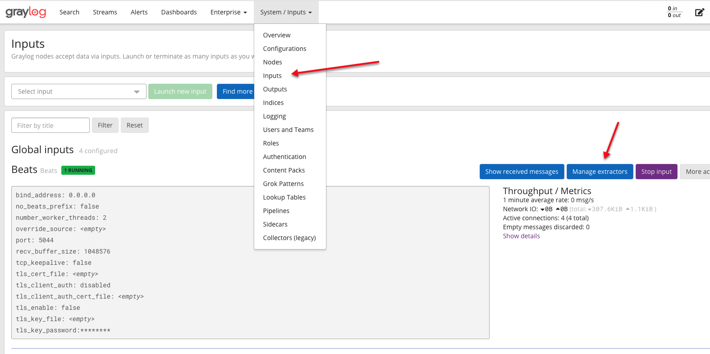

# Graylog extractor for Microsoft Teams Rooms Devices

A simple Graylog extractor for Microsoft Teams Rooms Devices

I created this to trigger useful Alarms, but it is in a very early beta stage!

## What it does

It extracts the JSON Information and parses the description field.

It transform this Message:

```json
{
  "Description": "Conference Microphone status : Unhealthy. Conference Speaker status : Unhealthy. Default Speaker status : Unhealthy. Camera status : Unhealthy. Front of Room Display status : Healthy. Motion Sensor status : Healthy. HDMI Ingest status : Healthy. Content Camera status : Healthy. ",
  "ResourceState": "Unhealthy",
  "OperationName": "HardwareCheckEngine",
  "OperationResult": "Fail",
  "OS": "Windows 10",
  "OSVersion": "10.0.18363.1316",
  "Alias": "XXX@XXX.net",
  "DisplayName": "Team Territory (enabling Technology)",
  "AppVersion": "4.7.15.0",
  "IPv4Address": "XXX.XXX.XXX.XXX",
  "IPv6Address": ""
}
```

into this:


And it transform this Message:

```json
{
  "Description": "Network status : Healthy. Exchange status : GeneralError. Signin status: Unhealthy. Teams Signin status: Unhealthy.",
  "ResourceState": "Unhealthy",
  "OperationName": "Heartbeat",
  "OperationResult": "Fail",
  "OS": "Windows 10",
  "OSVersion": "10.0.18363.1316",
  "Alias": "",
  "DisplayName": "",
  "AppVersion": "4.7.15.0",
  "IPv4Address": "XXX.XXX.XXX.XXX",
  "IPv6Address": ""
}
```

into this:


## Requirements

- [Graylog](https://www.graylog.org) (tested with 4.0.1)
- [Winlogbeat](https://www.elastic.co/beats/winlogbeat) (tested with 7.10.2)
- [Microsoft Teams Rooms](https://docs.microsoft.com/en-us/microsoftteams/rooms/) (tested with 4.7.15.0 on Windows 10 IoT Enterprise)

## Winlogbeat config

this is the minimum [Winlogbeat](https://www.elastic.co/beats/winlogbeat) configuration:

```yaml
# Define the output (we use Logstash for Graylog)
output.logstash:
  hosts:
    - "XXX.XXX.XXX.XXX:XXXX"

# Cleanup
path: null

# The amount of time to wait for all events to be published when shutting down.
winlogbeat.shutdown_timeout: 30s

# A list of entries (called dictionaries in YAML) that specify which event logs to monitor.
winlogbeat.event_logs:
  # Microsoft Skype for Business Rooms System and Microsoft Teams Rooms System only
  - name: Skype Room System
    level: "critical, error, warning"
    ignore_older: 24h
```

You will find this minimal config as [winlogbeat.yml](assets/winlogbeat.yml) in the [assets](assets) directory!

## Installation

Open your **Inputs** in **System / Inputs**



Then select **Manage extractors**, then click **Actions** and select **Export extractors**.


## Exctractors

Import the exctractors to your [Graylog](https://www.graylog.org) Inputs (Beats):

```json
{
  "extractors": [
    {
      "title": "MTR_StatusConferenceSpeaker",
      "extractor_type": "regex",
      "converters": [],
      "order": 1,
      "cursor_strategy": "copy",
      "source_field": "MTR_Description",
      "target_field": "MTR_StatusConferenceSpeaker",
      "extractor_config": {
        "regex_value": "^.*Conference Speaker status :\\s(.*?)\\..*$"
      },
      "condition_type": "regex",
      "condition_value": ".*$"
    },
    {
      "title": "MTR_StatusMotionSensor",
      "extractor_type": "regex",
      "converters": [],
      "order": 1,
      "cursor_strategy": "copy",
      "source_field": "MTR_Description",
      "target_field": "MTR_StatusMotionSensor",
      "extractor_config": {
        "regex_value": "^.*Motion Sensor status :\\s(.*?)\\..*$"
      },
      "condition_type": "regex",
      "condition_value": ".*$"
    },
    {
      "title": "MTR_StatusDefaultSpeaker",
      "extractor_type": "regex",
      "converters": [],
      "order": 1,
      "cursor_strategy": "copy",
      "source_field": "MTR_Description",
      "target_field": "MTR_StatusDefaultSpeaker",
      "extractor_config": {
        "regex_value": "^.*Default Speaker status :\\s(.*?)\\..*$"
      },
      "condition_type": "regex",
      "condition_value": ".*$"
    },
    {
      "title": "MTR_StatusConferenceMicrophone",
      "extractor_type": "regex",
      "converters": [],
      "order": 1,
      "cursor_strategy": "copy",
      "source_field": "MTR_Description",
      "target_field": "MTR_StatusConferenceMicrophone",
      "extractor_config": {
        "regex_value": "^.*Conference Microphone status :\\s(.*?)\\..*$"
      },
      "condition_type": "regex",
      "condition_value": ".*$"
    },
    {
      "title": "MTR_StatusFrontOfRoomDisplay",
      "extractor_type": "regex",
      "converters": [],
      "order": 1,
      "cursor_strategy": "copy",
      "source_field": "MTR_Description",
      "target_field": "MTR_StatusFrontOfRoomDisplay",
      "extractor_config": {
        "regex_value": "^.*Front of Room Display status :\\s(.*?)\\..*$"
      },
      "condition_type": "regex",
      "condition_value": ".*$"
    },
    {
      "title": "MTR_StatusHDMIIngest",
      "extractor_type": "regex",
      "converters": [],
      "order": 1,
      "cursor_strategy": "copy",
      "source_field": "MTR_Description",
      "target_field": "MTR_StatusHDMIIngest",
      "extractor_config": {
        "regex_value": "^.*HDMI Ingest status :\\s(.*?)\\..*$"
      },
      "condition_type": "regex",
      "condition_value": ".*$"
    },
    {
      "title": "MTR_StatusExchange",
      "extractor_type": "regex",
      "converters": [],
      "order": 1,
      "cursor_strategy": "copy",
      "source_field": "MTR_Description",
      "target_field": "MTR_StatusExchange",
      "extractor_config": {
        "regex_value": "^.*Exchange status :\\s(.*?)\\..*$"
      },
      "condition_type": "regex",
      "condition_value": ".*$"
    },
    {
      "title": "MTR_StatusSignin",
      "extractor_type": "regex",
      "converters": [],
      "order": 1,
      "cursor_strategy": "copy",
      "source_field": "MTR_Description",
      "target_field": "MTR_StatusSignin",
      "extractor_config": {
        "regex_value": "^.*\\. Signin status:\\s(.*?)\\..*$"
      },
      "condition_type": "regex",
      "condition_value": ".*$"
    },
    {
      "title": "MTR_StatusCamera",
      "extractor_type": "regex",
      "converters": [],
      "order": 1,
      "cursor_strategy": "copy",
      "source_field": "MTR_Description",
      "target_field": "MTR_StatusCamera",
      "extractor_config": {
        "regex_value": "^.*\\. Camera status :\\s(.*?)\\..*$"
      },
      "condition_type": "regex",
      "condition_value": ".*$"
    },
    {
      "title": "MTR_StatusContentCamera",
      "extractor_type": "regex",
      "converters": [],
      "order": 1,
      "cursor_strategy": "copy",
      "source_field": "MTR_Description",
      "target_field": "MTR_StatusContentCamera",
      "extractor_config": {
        "regex_value": "^.*Content Camera status :\\s(.*?)\\..*$"
      },
      "condition_type": "regex",
      "condition_value": ".*$"
    },
    {
      "title": "Extract MTR JSON Fields",
      "extractor_type": "json",
      "converters": [],
      "order": 0,
      "cursor_strategy": "copy",
      "source_field": "winlogbeat_winlog_event_data_param1",
      "target_field": "",
      "extractor_config": {
        "flatten": true,
        "list_separator": ", ",
        "kv_separator": "=",
        "key_prefix": "MTR_",
        "key_separator": "_",
        "replace_key_whitespace": false,
        "key_whitespace_replacement": "_"
      },
      "condition_type": "string",
      "condition_value": "status :"
    },
    {
      "title": "MTR_StatusTeamsSignin",
      "extractor_type": "regex",
      "converters": [],
      "order": 1,
      "cursor_strategy": "copy",
      "source_field": "MTR_Description",
      "target_field": "MTR_StatusTeamsSignin",
      "extractor_config": {
        "regex_value": "^.*Teams Signin status:\\s(.*?)\\..*$"
      },
      "condition_type": "regex",
      "condition_value": ".*$"
    },
    {
      "title": "MTR_StatusNetwork",
      "extractor_type": "regex",
      "converters": [],
      "order": 1,
      "cursor_strategy": "copy",
      "source_field": "MTR_Description",
      "target_field": "MTR_StatusNetwork",
      "extractor_config": {
        "regex_value": "^.*Network status :\\s(.*?)\\..*$"
      },
      "condition_type": "regex",
      "condition_value": ".*$"
    }
  ],
  "version": "4.0.1"
}
```

You will find the extractors as [extractors.json](assets/extractors.json) in the [assets](assets) directory!
